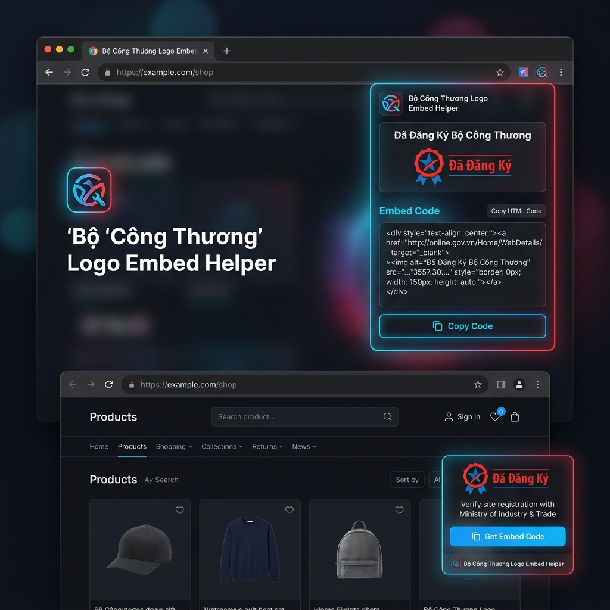

# Bộ Công Thương Logo Embed Helper (Chrome Extension Manifest V3)

Bộ Công Thương Logo Embed Helper là một Chrome Extension được thiết kế nhằm giúp các nhà phát triển web, thiết kế giao diện và doanh nghiệp thương mại điện tử tại Việt Nam dễ dàng lấy mã nhúng HTML và liên kết xác thực logo "Đã Đăng Ký / Đã Thông Báo" từ trang web chính thức của Bộ Công Thương (`online.gov.vn`).



## Các tính năng chính

- **Tự động nhận diện ID doanh nghiệp**: Tiện ích tự động trích xuất UUID/ID của doanh nghiệp ngay trên đường dẫn URL của trang chi tiết đăng ký.
- **Bảng điều khiển kéo thả (Draggable Panel)**: Injected widget dạng kính mờ (glassmorphism) hiện đại xuất hiện ở góc dưới trang web. Bạn có thể nhấn giữ và kéo thả phần tiêu đề để di chuyển bảng điều khiển này tới bất kỳ đâu trên màn hình, tránh che khuất nội dung gốc.
- **Hệ thống thông báo Toast mượt mà**: Mỗi khi bấm copy thành công, hệ thống Toast kính mờ màu xanh lá sẽ trượt từ trên màn hình xuống cùng hiệu ứng chuyển đổi icon checkmark động cực kỳ trực quan.
- **Hỗ trợ đa định dạng mã nhúng**:
  - **HTML Code**: Tạo sẵn thẻ `<a>` chứa liên kết trang và thẻ `` chứa logo chính thức `logoCCDV.png`.
  - **Markdown Code**: Cú pháp sẵn sàng để copy và paste thẳng vào tệp `README.md` trên GitHub hoặc các trình soạn thảo Markdown.
- **Sao chép siêu tốc các siêu dữ liệu**: Cho phép sao chép nhanh Mã công ty (UUID) và Đường dẫn đăng ký (URL) chỉ với một cú click chuột vào các icon copy nhỏ.
- **Xác thực dữ liệu trực tuyến qua API**: Tiện ích gọi API công khai của Bộ Công Thương (`api.online.gov.vn`) để tải và hiển thị tên doanh nghiệp, tên nền tảng và trạng thái xác nhận thực tế.
- **Chính sách bảo mật nghiêm ngặt (Domain Allow Policy)**: Tiện ích chỉ chạy duy nhất trên tên miền `online.gov.vn`, đảm bảo an toàn bảo mật tuyệt đối cho trình duyệt của bạn.

## Cấu trúc thư mục mã nguồn

```text
bct_logo_extension/
├── manifest.json         # Cấu hình Manifest V3 của Extension
├── popup.html            # Giao diện Popup khi bấm vào icon Extension
├── popup.css             # Định dạng CSS cho Popup (Dark theme & Glow effect)
├── popup.js              # Xử lý logic trích xuất URL, gọi API và sao chép trên Popup
├── content.js            # Script tự động chạy trên trang online.gov.vn, vẽ và xử lý Widget nổi
├── content.css           # Định dạng CSS cô lập cho Widget nổi, Toast và các hiệu ứng động
└── icons/                # Chứa các tệp icon kích thước 16x16, 48x48, 128x128
```

## Hướng dẫn cài đặt vào Google Chrome

Để cài đặt và sử dụng tiện ích trực tiếp từ mã nguồn, hãy làm theo các bước sau:

1. **Tải xuống mã nguồn**: Tải xuống tệp tin ZIP của dự án và giải nén ra một thư mục trên máy tính của bạn.
2. **Mở trang quản lý tiện ích**: Trên trình duyệt Chrome, truy cập vào đường dẫn `chrome://extensions/` (hoặc nhấn vào biểu tượng 3 chấm đứng góc trên bên phải -> Chọn **Extensions** -> **Manage Extensions**).
3. **Kích hoạt Chế độ nhà phát triển**: Ở góc trên cùng bên phải màn hình quản lý tiện ích, gạt công tắc **Developer mode** sang trạng thái **Bật**.
4. **Nạp tiện ích đã giải nén**: Click vào nút **Load unpacked** ở góc trên cùng bên trái và chọn thư mục chứa mã nguồn (thư mục `bct_logo_extension` chứa file `manifest.json`).
5. **Ghim tiện ích**: Bấm vào biểu tượng mảnh ghép trên thanh công cụ của Chrome và bấm vào biểu tượng ghim cạnh **Bộ Công Thương Logo Embed Helper** để truy cập nhanh từ thanh địa chỉ.

## Hướng dẫn sử dụng & Kiểm thử

1. **Kiểm thử chính sách bảo mật tên miền**: Truy cập bất kỳ trang web nào khác (ví dụ: `google.com`). Khi click vào icon Extension, bạn sẽ thấy thông báo đỏ yêu cầu mở trang `online.gov.vn`. Widget nổi cũng sẽ không được tải để bảo vệ tài nguyên trình duyệt.
2. **Kiểm thử trên trang Bộ Công Thương**: Truy cập một trang chi tiết đăng ký doanh nghiệp bất kỳ (Ví dụ: `http://online.gov.vn/nen-tang/6fa369f9-dc53-45be-9f69-014b06f1aa68`).
3. **Sử dụng Widget nổi**: Bạn sẽ thấy một nút tròn nhấp nháy ở góc dưới bên phải màn hình. Click vào để mở bảng điều khiển. Tại đây bạn có thể kéo thả di chuyển card, chọn tab HTML hoặc Markdown để sao chép mã nhúng.
4. **Sử dụng Popup**: Click trực tiếp vào icon tiện ích trên thanh công cụ Chrome để xem thông tin doanh nghiệp được đồng bộ từ API và chọn copy mã nhúng ngay lập tức.

## Giấy phép

Mã nguồn được phân phối theo giấy phép MIT. Bạn được tự do sử dụng, chỉnh sửa và chia sẻ phục vụ mục đích cá nhân và thương mại.
